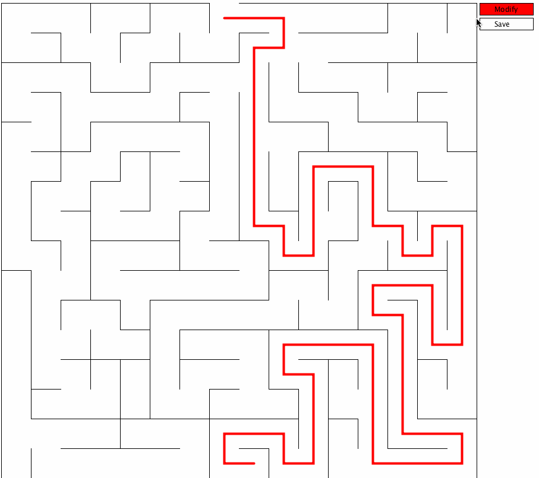

# maze
Create and solve fun maze problems through this simple Processing 3 utility!
A naive implementation of DFS solver is included.
Note that teh given solution is suboptimal as the algorithm stops as soon as it finds a solution.

## Demo below:
 

